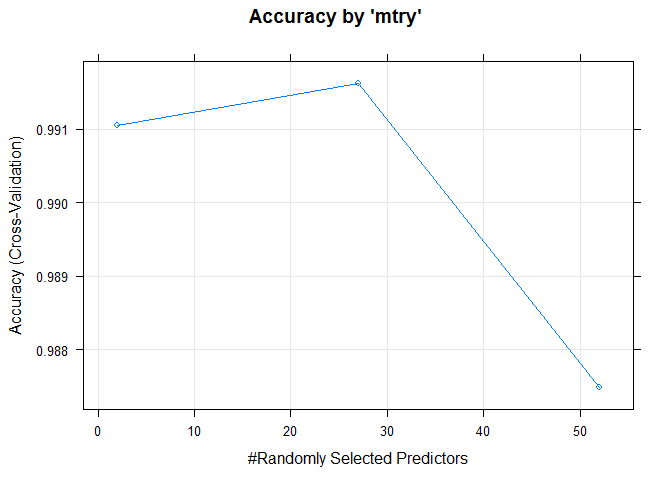
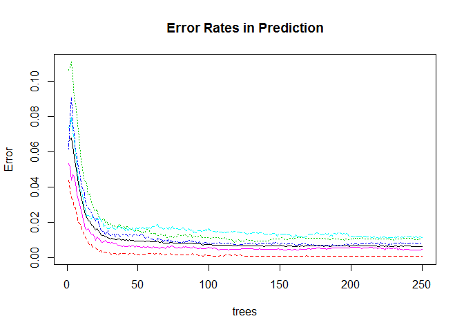

# Human Activity Recognition & Prediction using Machine Learning Algorithms - Assignment
Murali Krishna K S S  
12 January 2017  

##1. Background:
1.1. The objective of this project is to predict / classify each of the 20 observations contained in the test data set with the help of a prediction model generated using any of the machine learning algorithms and the given training set. 

1.2. The training and test sets contain data from accelerometers that were placed on belt, forearm, arm and dumbbell of 6 participants while the participants performed 5 classes of routines under Unilateral Dumbbell Biceps Curl in a controlled environment (courtesy: http://groupware.les.inf.puc-rio.br/har). 

1.3. Participants performed following five classes of dumbbell lifts that comprised of one correct method of execution and four others representing common mistakes committed by people during dumbbell Biceps Curl : 

- Class 'A' : Correct method of execution
- Class 'B' : Throwing the elbows to the front
- Class 'C' : Lifting the dumbbell only half-way
- Class 'D' : Lowering the dumbbell only half-way
- Class 'E' : Throwing the hips to the front

##2. Data Processing


```r
library(caret); library(gbm); library(e1071); library(randomForest)
##-URL of Data Sources 
trainURL <- "https://d396qusza40orc.cloudfront.net/predmachlearn/pml-training.csv"
testURL <- "https://d396qusza40orc.cloudfront.net/predmachlearn/pml-testing.csv"
##-Download if data files are not available locally
if (!file.exists("rawdata/pml_training.csv")) 
        {download.file(trainURL, "rawdata/pml_training.csv", method="libcurl") }
if (!file.exists("rawdata/pml_testing.csv")) 
        {download.file(testURL, "rawdata/pml_testing.csv", method="libcurl") }
##-Load the training set
trainset <- read.csv("rawdata/pml_training.csv",header = T)
classe.col <- grep("classe",names(trainset))
nearEmpty <- unname(which((colSums(is.na(trainset))/nrow(trainset)) > 0.97))
nearConstant <- nearZeroVar(trainset) 
toRemove <- union(1:7,union(nearEmpty,nearConstant))
```

2.1. **Download datafile:** Training data was downloaded from https://d396qusza40orc.cloudfront.net/predmachlearn/pml-training.csv to local disk and then loaded into a data-frame called "trainset".

2.2. **Exploration of the datafile:** The training data contains:

a. 19622 observations and 160 variables
b. has a variable called 'classe', that holds outcome (classifier - 'A' to 'E')
c. 67 variables that have less than 3% data in them (nearly empty variables)
d. 60 variables with very low variance in their values (near zero variable predictors)
e. first seven variables as - X, user_name, raw_timestamp_part_1, raw_timestamp_part_2, cvtd_timestamp, new_window, num_window

2.3. **Reduction of variables:** It is decided not to use 107 variables (combined variables as in 2.1.c, 2.1.d and 2.1.e) in the computations. 

a. It becomes apparent in the later sections that their elimination does not impact prediction accuracy. 
b. Existence of NA's as in 67 variables (2.c. above) pose problems for some of the algorithms. 
c. Certain algorithms like Random Forest algorithm do not accept large number of predictors. 

2.4. **Predictors:** Models for predicting 'classe' (classifier outcome) will be generated using the remaining 52 predictors, i.e.,
       
- roll_belt, pitch_belt, yaw_belt, total_accel_belt, gyros_belt_x, gyros_belt_y, gyros_belt_z, accel_belt_x, accel_belt_y, accel_belt_z, magnet_belt_x, magnet_belt_y, magnet_belt_z, roll_arm, pitch_arm, yaw_arm, total_accel_arm, gyros_arm_x, gyros_arm_y, gyros_arm_z, accel_arm_x, accel_arm_y, accel_arm_z, magnet_arm_x, magnet_arm_y, magnet_arm_z, roll_dumbbell, pitch_dumbbell, yaw_dumbbell, total_accel_dumbbell, gyros_dumbbell_x, gyros_dumbbell_y, gyros_dumbbell_z, accel_dumbbell_x, accel_dumbbell_y, accel_dumbbell_z, magnet_dumbbell_x, magnet_dumbbell_y, magnet_dumbbell_z, roll_forearm, pitch_forearm, yaw_forearm, total_accel_forearm, gyros_forearm_x, gyros_forearm_y, gyros_forearm_z, accel_forearm_x, accel_forearm_y, accel_forearm_z, magnet_forearm_x, magnet_forearm_y, magnet_forearm_z, classe

2.5. **Data partitioning:** The training set will be partitioned into training and validation sets in the proportion of 70 : 30. 


```r
set.seed(1234)
##-Partition the training data into training set and validation sets
trainIndex <- createDataPartition(trainset$classe,p=0.7,list=F)
validationset <- trainset[-trainIndex,]
trainset <- trainset[trainIndex,]

##-Check the resulting training set and validation set
partsize <- rbind("trainset"= dim(trainset), "validationset" = dim(validationset))
colnames(partsize) <- c("Observations", "Variables")
partsize
```

```
##               Observations Variables
## trainset             13737       160
## validationset         5885       160
```

2.6. **Composition of test and validation sets:** The samples partitioned as training and validation sets contain identical proportion of classes. Percentage distribution of classes within training and validation sets is as follows:


```r
round(rbind("trainset" = prop.table(table(trainset$classe)),
      "validationset" = prop.table(table(validationset$classe))) * 100,2)
```

```
##                   A     B     C     D     E
## trainset      28.43 19.35 17.44 16.39 18.38
## validationset 28.45 19.35 17.43 16.38 18.39
```

##3. Model tuning and Prediction analysis 

3.1. **Algorithms** : Multiple classification algorithms were used viz., rpart, gbm, lda, rf and svm to identify the most suitable model for prediction. 

3.2. **Caret package** was used for data splitting, feature selection, model tuning and variable importance selection.    

3.3. The **"trainset"** with 52 predictors was used for developing and tuning the model to predict the classifier present in the variable 'classe'. 

3.4. **Recursive partitioning for classification (rpart) :**  Vairable 'modelRP' holds the fitted model and data generated by 'train' function using 'rpart' method.

```r
set.seed(1234)
modelRP <- train(classe ~.,data= trainset[,-toRemove], method = "rpart")
```

3.5. **Generalized Boosted Regression Model (gbm):** Vairable 'modelGBM' holds the fitted model and data generated by 'train' function using 'gbm' method.

```r
modelGBM <- train(classe ~ ., data=trainset[,-toRemove], method="gbm", verbose = FALSE)
```

3.6. **Collapsed Gibbs Samplers and Related Utility Functions for LDA-type
Models (lda):** Variable'modelLDA' holds the fitted model and data generated by 'train' function using 'lda' method.

```r
modelLDA <- train(classe ~ ., data=trainset[,-toRemove], method="lda")
```

3.7. **Breiman and Cutler's Random Forests for Classification and Regression (rf):** Variable'modelRF' holds the fitted model and data generated by 'train' function using 'rf' method.

```r
modelRF <- train(classe ~ ., data = trainset[,-toRemove], method = "rf", trControl = trainControl(method = "cv",5),ntree=250)
```

3.8. **Support Vector Machines (svm):** Variable'modelSVM' holds the fitted model and data generated by 'train' function using 'svmRadial' method.

```r
modelSVM <- train(classe ~., data=trainset[,-toRemove], method="svmRadial")
```

##4. Evaluation of Out-of-Sample Accuracy and Error rates

4.1. Values of classifier are generated using fitted-models (obtained from previous process) and the predictors in 'validationset'. 

```r
predRP <- predict(modelRP, validationset[,-toRemove])
predRF <- predict(modelRF, validationset[,-toRemove])
predGBM <- predict(modelGBM, validationset[,-toRemove])
predLDA <- predict(modelLDA, validationset[,-toRemove])
predSVM <- predict(modelSVM, validationset[,-toRemove])
```

4.2. Prediction accuracy was examined to identify the best of the models. ModelRF representing Random Forest model outperformed the others in accuracy.


```r
# How do different methods fare - out of sample error
howGood <- rbind(
        "RandomForest.rf (modelRF)"=confusionMatrix(predRF, validationset$classe)$overall[1],
        "Boosting.gbm (modelGBM)"=confusionMatrix(predGBM, validationset$classe)$overall[1],
        "SupportVectorMachine.svmRadial (modelSVM)"=confusionMatrix(predSVM, validationset$classe)$overall[1],
        "LinearDiscriminantAnalysis.lda (modelLDA)"= confusionMatrix(predLDA, validationset$classe)$overall[1],
        "DecisionTree.rpart (modelRP)"=confusionMatrix(predRP, validationset$classe)$overall[1])
howGood <- cbind(howGood, 1-howGood )
colnames(howGood)= c("Accuracy","Error")
howGood
```

```
##                                            Accuracy       Error
## RandomForest.rf (modelRF)                 0.9940527 0.005947324
## Boosting.gbm (modelGBM)                   0.9663551 0.033644860
## SupportVectorMachine.svmRadial (modelSVM) 0.9301614 0.069838573
## LinearDiscriminantAnalysis.lda (modelLDA) 0.7048428 0.295157179
## DecisionTree.rpart (modelRP)              0.4890399 0.510960068
```

##5. Selection of model

5.1. Above analysis reveals that model generated using Random Forests algorithm provides the best **prediction accuracy at 99.41 percentage** and a low **out of sample error of  0.59 percentage**. Hence model held in **'modelRF' will be used to predict the test set**.

5.2. Random Forest algorithm used 250 trees, different number of predictors (mtry)  and 5-fold cross validation to tune the model. 

a. Accuracy peaked at mtry = 27. Accuracy was higher when mtry =2 than when mtry=52.
b. Prediction errors fell rapidly until number of trees were 50 and thereafter nearly evened out.


```r
plot(modelRF, main = "Accuracy by 'mtry'")
```

<!-- -->

```r
plot(modelRF$finalModel, main= "Error Rates in Prediction")
```

<!-- -->

```r
modelRF
```

```
## Random Forest 
## 
## 13737 samples
##    52 predictor
##     5 classes: 'A', 'B', 'C', 'D', 'E' 
## 
## No pre-processing
## Resampling: Cross-Validated (5 fold) 
## Summary of sample sizes: 10990, 10990, 10990, 10989, 10989 
## Resampling results across tuning parameters:
## 
##   mtry  Accuracy   Kappa    
##    2    0.9910463  0.9886729
##   27    0.9916287  0.9894095
##   52    0.9874798  0.9841611
## 
## Accuracy was used to select the optimal model using  the largest value.
## The final value used for the model was mtry = 27.
```

5.3. Top 10 predictors of Random Forest model (modelRF) given by their gini coefficients are listed.

```r
##-Gini coefficient denoting significance of the variable
impPred <- cbind(rownames(modelRF$finalModel$importance),
                 unname(modelRF$finalModel$importance))
colnames(impPred) <- c("predictors","gini.coef")
impPred <- impPred[order(as.numeric(impPred[,2]),decreasing = T),]
head(impPred,10)
```

```
##       predictors          gini.coef         
##  [1,] "roll_belt"         "1398.66040196457"
##  [2,] "pitch_forearm"     "855.264914717832"
##  [3,] "yaw_belt"          "820.82812450422" 
##  [4,] "magnet_dumbbell_y" "648.228182613117"
##  [5,] "pitch_belt"        "640.020484981621"
##  [6,] "magnet_dumbbell_z" "624.281318730453"
##  [7,] "roll_forearm"      "569.253879134222"
##  [8,] "accel_dumbbell_y"  "305.722183541209"
##  [9,] "roll_dumbbell"     "277.102052546773"
## [10,] "magnet_dumbbell_x" "254.645809390191"
```

5.4. Potential to reduce the predictors was explored. Very high prediction accuracy of Random Forest model could be achieved using just the top 10 or top 5 predictors.  

```r
## Reduction in set of predictors based on their gini coefficient values 
modelRF10 <- train(classe ~ ., data = trainset[,c(impPred[1:10,"predictors"],"classe")],
                   method = "rf", trControl = trainControl(method = "cv",5),ntree=50)
modelRF05 <- train(classe ~ ., data = trainset[,c(impPred[1:5,"predictors"],"classe")],
                   method = "rf", trControl = trainControl(method = "cv",5),ntree=50)

howGood2 <- rbind("modelRF"=confusionMatrix(predRF, validationset$classe)$overall[1],
        "modelRF10"=confusionMatrix(predict(modelRF10, validationset), validationset$classe)$overall[1],
        "modelRF05"= confusionMatrix(predict(modelRF05, validationset), validationset$classe)$overall[1])
howGood2 <- cbind(howGood2, 1-howGood2 )
colnames(howGood2)= c("Accuracy","Error")
howGood2
```

```
##            Accuracy       Error
## modelRF   0.9940527 0.005947324
## modelRF10 0.9835174 0.016482583
## modelRF05 0.9670348 0.032965166
```

##6. Prediction of the Test data set

6.1. Test data set was obtained from https://d396qusza40orc.cloudfront.net/predmachlearn/pml-testing.csv. The selected Random Forest model (stored in modelRF) with an **expected error rate of 0.59 percent** .was used to predict the classifiers for the test set. The results are as under:


```r
testset <- read.csv("rawdata/pml_testing.csv",header = T)
predTEST <- predict(modelRF,testset)
predTEST
```

```
##  [1] B A B A A E D B A A B C B A E E A B B B
## Levels: A B C D E
```
##7. Conclusion:

7.1 The classifers of 20 observations of test data set were predicted as B, A, B, A, A, E, D, B, A, A, B, C, B, A, E, E, A, B, B, B using the Random Forest model that was generated using 52 predictors of trainset data. The accuracy levels of all the models are compared with the predTEST values and results are as follows:


| modelRP.Accuracy| modelGBM.Accuracy| modelLDA.Accuracy| modelSVM.Accuracy| modelRF10.Accuracy| modelRF05.Accuracy|
|----------------:|-----------------:|-----------------:|-----------------:|------------------:|------------------:|
|              0.4|                 1|               0.7|                 1|                  1|                  1|

7.2. It was interesting to observe that Random Forest model built using top 5 predictors and top 10 predictors predicted the classifiers of test set as accurately as the one that used 52 predictors. The other models generated using GBM and SVM too matched the prediction values of test data set with those of Random Forest model.  
